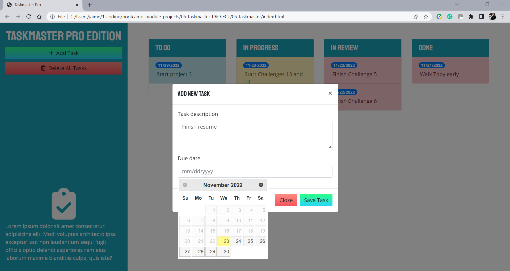

# Taskmaster-Pro

## Table of Contents
- [Project Description](#Project-Description)
- [User Story](#User-Story)
- [Screen Captures](#Screen-Captures)
- [Technologies](#Technologies)
- [Links](#Links)


## Project Description
Expand an application called Taskmaster, using the existing codebase from the first version. The project consisted in creating a new design that incorporates new features, resulting in an improved user experience.

The project adds the ability to edit tasks and dates. Using jQuery UI, dragging and dropping functionality was implemented within and between the status columns. The delete function was also implemented using dragging and dropping on a specific delete area. The due date for each task is now editable and the Datepicker input field was integrated. The layout was updated to be responsive for new statuses based on the current date. The project also includes a redesign of the application that makes enhances the user experience.
###### [Back to Index](#Table-of-Contents)


## User Story
```
AS A web developer working on a task-management application
I WANT to enhance an existing codebase and expand the application functionality and capabilities using jQuery
SO THAT I can create, update (using drag/drop) and delete tasks, while improving the user experience.

```
###### [Back to Index](#Table-of-Contents)


## Screen Captures





###### [Back to Index](#Table-of-Contents)


## Technologies


###### [Back to Index](#Table-of-Contents)


## Links
- [Deployed Application](https://alexjcturbo.github.io/taskmaster/)
###### [Back to Index](#Table-of-Contents)